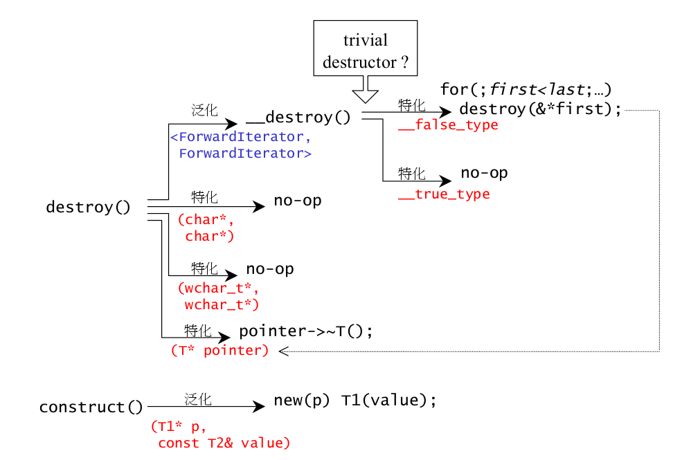

#STL源码剖析
##空间配置器
---
> 空间配置器总是隐藏在容器的背后，负责内存、磁盘以及其它辅助存储介质的配置。

  一般而言，C++内存配置操作和释放是通过`new`和`delete`。其中`new`算式内含两阶段操作:(1)调用::operator new 配置内存;(2)调用对应类的构造函数构造对象内容。相应的`delete`操作也内含两阶段操作:(1)调用析构函数将对象析构;(2)调用::operator delete释放内存。
  
  **构造和析构基本工具：construct()和destroy()**。如果是用户没有自定义析构函数，则调用trivial destructor，否则调用no-trivial destructor()。因为要把[first, last)范围所有对象析构掉，万一这个范围很大，而每个对象的析构函数都是trivial destructor，一次次调用这些无关痛痒的析构函数，对效率是一种伤害。对于trivial destructor在析构阶段什么都不做就结束。
  
  
  
  
  **空间的配置与释放**。对象构造前进行空间配置，对象析构后进行空间释放。主要处理以下一些情况：

 * 向system heap要求空间
 * 考虑多线程状态
 * 考虑内存不足情况
 * 考虑内存碎片问题
 
 
 为了处理内存碎片问题，可以视情况不同而采用不同的策略：当配置区块超过128bytes时，视之足够大，调用第一级配置器，直接分配空间；当配置区块小于128bytes时，为了降低额外负担，采用复杂的memory pool整理方式：每次配置一大块内存，并维护对应自由链表。下次若再有相同大小的内存需求，就直接从free-lists中拔出。
 
 C++ new handler机制是指可以要求系统在内存配置需求无法被满足时，调用一个指定的函数。C++ new handler机制来处理内存不足情况