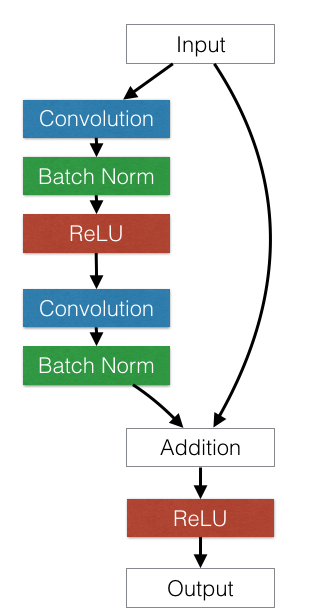

#Deep Residual Learning for Image Recognition
> 2016年CVPR的best paper, 文章不是针对目标检测来做的，但其解决了一个最根本的问题：更有力的特征。检测时基于Faster R-CNN的目标检测框架，使用ResNet替换VGG16网络可以取得更好的检测结果。[论文](http://www.cv-foundation.org/openaccess/content_cvpr_2016/papers/He_Deep_Residual_Learning_CVPR_2016_paper.pdf), [code](https://github.com/KaimingHe/deep-residual-networks#third-party-re-implementations)。

论文阐述了在Deep Learning模型中，深度十分重要，而且梯度消息的问题也可以通过规范化的权值初始化，添加归一化层等方法得到改善，所以非常深的深度成为许多深度学习模型的选择。但是非常深的深度存在着Degradation的问题。随着层数的增加，准确性开始饱和，然后快速下降，越多的层，会导致更高的训练误差, 如图1所示。

随后提出了Residual Learning框架， 假设原来的深度学习模型中，每一层学到的是一个潜在的映射$$H(x)$$ , 在Residual Learning中，每一层学到的是$$F(x) = H(x) － x $$，并认为其更容易优化和因为层数增加而受益。其框架如图２所示。

与VGG模型、34层不加input、34层ResNet做了对比, ResNet可以提取到更好的特征，具有更好的训练误差，测试效果更好。然后做了不同层数的ResNet对比，层数的增加不断减少ResNet的训练误差。

###需要注意的一些实现细节

1. Scale augmentation. 将图片小的一边随机放大到[224, 480]之间,然后再随机截取224*224大小区域，随机做水平翻转，并且减去均值。

2. Standard color augmentation. 这个不大懂, 要去看这篇[论文](http://papers.nips.cc/paper/4824-imagenet-classification-with-deep-convolutional-neural-networks.pdf)

3. 要注意在卷积之后和ReLU之前做Batch Norm处理
