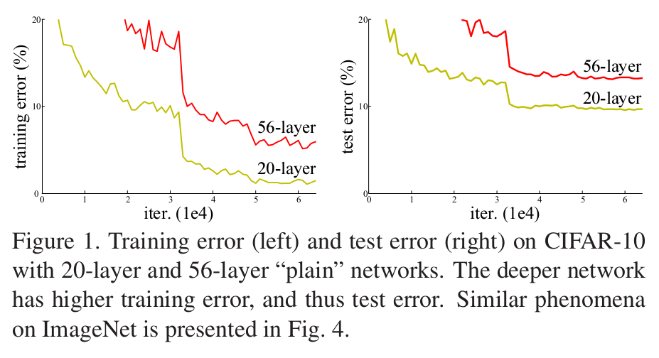
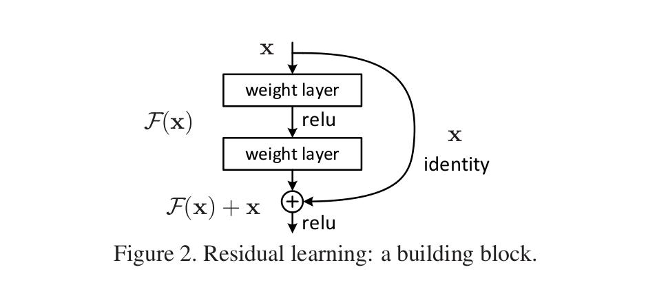

#Deep Residual Learning for Image Recognition
> 2016年CVPR的best paper, 文章不是针对目标检测来做的，但其解决了一个最根本的问题：更有力的特征。检测时基于Faster R-CNN的目标检测框架，使用ResNet替换VGG16网络可以取得更好的检测结果。

论文阐述了在Deep Learning模型中，深度十分重要，而且梯度消息的问题也可以通过规范化的权值初始化，添加归一化层等方法得到改善，所以非常深的深度成为许多深度学习模型的选择。但是非常深的深度存在着Degradation的问题。随着层数的增加，准确性开始饱和，然后快速下降，越多的层，会导致更高的训练误差, 如图1所示。

随后提出了Residual Learning框架， 假设原来的深度学习模型中，每一层学到的是一个潜在的映射$$H(x)$$ , 在Residual Learning中，每一层学到的是$$F(x) = H(x) + x $$，其框架如图２所示

